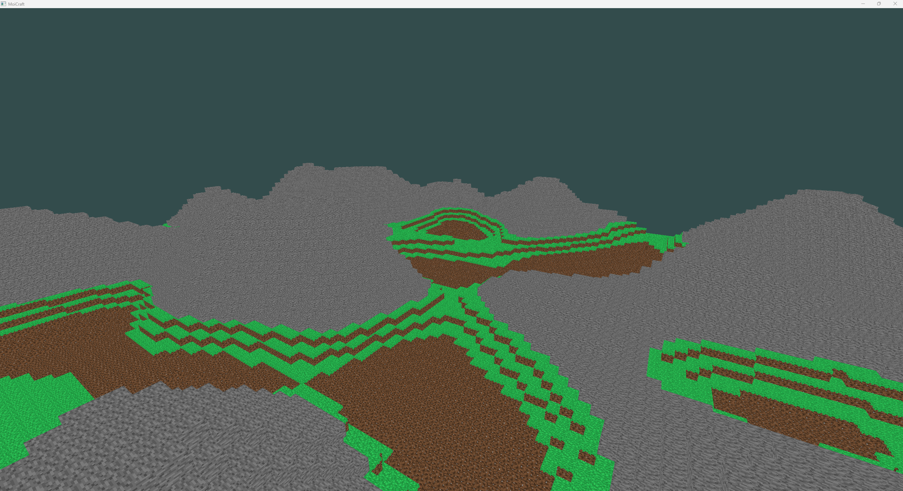
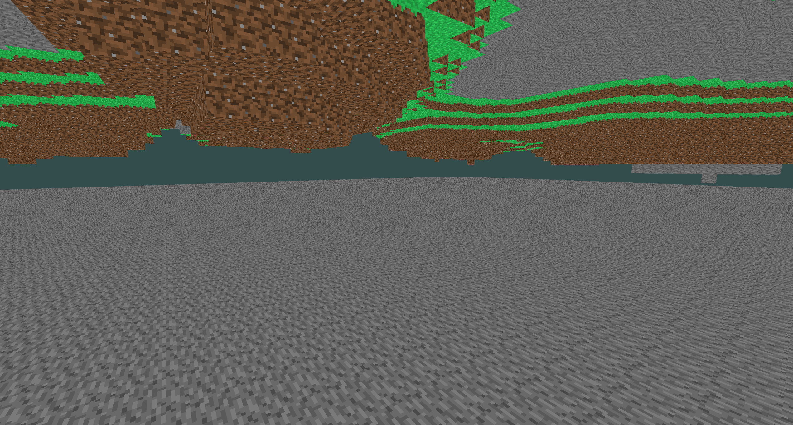

# MoiCraft

A Minecraft-style voxel engine written in C++ using OpenGL. This project focuses on procedural terrain generation, chunk-based rendering, and performance optimization using multi-threaded chunk loading.

## Screenshots






## Features

- Written using modern OpenGL and C++
- Infinite procedurally generated terrain using Perlin noise
- Chunk-based world management
- Multi-threaded chunk generation to reduce frame lag
- First-person camera controls
- Optimized mesh generation with face culling

## Technologies Used

- C++
- OpenGL (via GLAD)
- GLFW for windowing and input
- GLM for math
- stb_image for texture loading
- Custom Perlin noise for terrain generation

## Project Structure

- Block.* # Block data and face generation
- Camera.* # First-person camera and view matrix logic
- ChunkManager.* # Handles block data and mesh generation for a chunk
- Config.h # Constants (e.g., chunk size, render distance)
- Game.* # Main game loop and update/render logic
- InputManager.* # Handles keyboard and mouse input
- TextureManager.* # Texture loading and management
- Window.* # GLFW window wrapper
- WorldManager.* # Manages visible chunks and background loading
- main.cpp # Program entry point

## Multi-Threading

Chunks are generated in a background thread using a job queue. This helps reduce frame drops when loading new terrain.

## Controls

- `W A S D` — Move
- 'SPACE' — Move Upwards
- 'LSHIFT' — Move Downwards
- Mouse — Look around
- `ESC` — Exit

## Build Instructions

### Requirements

- C++17 or newer
- CMake (or build using Visual Studio)
- OpenGL 3.3+
- GLFW
- GLAD
- stb_image

### CMake
1. Clone the repo:
   ```bash
   git clone --recursive https://github.com/moisesc112/moi-craft.git
   cd MoiCraft
2. Configure
   ```bash
   mkdir build
   cd build
   cmake -B build -S . -G "Visual Studio 17 2022" -A x64
3. Build project with either Release or Debug:
   ```bash
   cmake --build build --config Release
   cmake --build build --config Debug
4. Run the Game through VS 2022:
   ```bash
   Open .sln file, right click in Solution Explorer and set as Startup Project
5. Or through terminal:
   ```bash
   .\build\<Build Type>\MoiCraft.exe (or .\build\x64\<Build Type>\MoiCraft.exe)
### Windows (Visual Studio)

1. Clone the repo:
   ```bash
   git clone https://github.com/moisesc112/moi-craft.git
   cd moicraft
2. Open the .sln file in Visual Studio 2022.
3. Set the build mode to Release.
4. Build and run.
